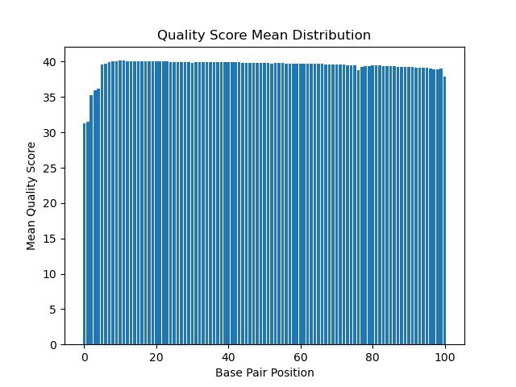
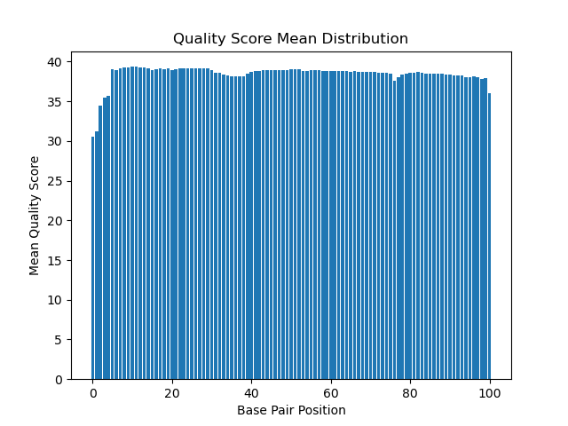

```{r setup, include=FALSE}
knitr::opts_chunk$set(echo = TRUE)
library(readr)
library(ggplot2)
library(dplyr)
library(tidyverse)
```


Part 1 Read Quality Score Distributions 


1. FastQC Plots


19_3F_fox_S14_L008_R1


19_3F_fox_S14_L008_R2


7_2E_fox_S6_L008_R1


7_2E_fox_S6_L008_R2


From these plots, there seems to be a correlation between per-base N content and quality score plots which is only really noticeable at the lowest base pair positions. The per-base N content plots all have a small peak at the lowest position base pair position where the quality score are consistently lowest. However, in the case of the 7_2E_fox_S6_L008_R2 sample, the lower quality scores are not noticeable in the corresponding per-base N content plot. 


2. Quality Score Script Plots


19_3F_fox_S14_L008_R1


19_3F_fox_S14_L008_R2


7_3F_fox_S14_L008_R1


7_3F_fox_S14_L008_R2


2. Quality Score Distribution Comparisons

The fastQC distributions and the distributions that were produced by my script follow similar trends with regard to shape. For both, the quality starts at its lowest values fo the first few base pair position, then raises to a more consistent higher quality score for the rest of the distribution. The fastQc graphs include box and whisker plots for each position which provides additional information. These plots describe range, mean and quartiles for each position base pair position in the graph. The fastQC graphs also include bin values for the base pair position along the x-axis. The runtime is very fast when using FastQC, whereas my script is slower, taking almost 2 minutes to complete. FastQC has been optimized for this type of quality analysis by experienced developers and provides more thorough output than my script which was made with little experience.     


3. Comment on the overall data quality of your two libraries

In both paired end samples, the R1 reads have better quality scores across their base pairs positions than the R2 reads. R1 reads take place before R2 reads, so the R2 libraries have more time to degrade on the sequencer prior to the reads taking place. This trend is reflected well in the 7_2E_fox_S6_L008_R2 sample where the quality scores are consistently lower than the corresponding R1 sample. 


Part 2 - Adapter Trimming Comparison


``` {r Adapters, echo=FALSE}
Adapters_table <- matrix(c("19_3F_Fox_R1", "546,623 (3.3%)", "19_3F_Fox_R2", "676,564 (4.1%)", "7_2E_fox_R1", "173,473 (3.3%)", "7_2E_fox_R2", "212,512 (4.0%)"), ncol=2, byrow = TRUE)
colnames(Adapters_table) <- c("Sample", "Adapters Trimmed")
rownames(Adapters_table) <- c(1, 2, 3, 4)
Adapters_table <- as.table((Adapters_table))              

Adapters_table

```


Adapters

R1 Adapter: AGATCGGAAGAGCACACGTCTGAACTCCAGTCA
R2 Adapter: AGATCGGAAGAGCGTCGTGTAGGGAAAGAGTGT


Unix commands to search for adapters:

zcat 19_3F_fox_S14_L008_R1_001.fastq.gz | grep "AGATCGGAAGAGCACACGTCTGAACTCCAGTCA" | wc
zcat 19_3F_fox_S14_L008_R2_001.fastq.gz | grep "AGATCGGAAGAGCGTCGTGTAGGGAAAGAGTGT" | wc
zcat 7_2E_fox_S6_L008_R1_001.fastq.gz | grep "AGATCGGAAGAGCACACGTCTGAACTCCAGTCA" | wc
zcat 7_2E_fox_S6_L008_R2_001.fastq.gz | grep "AGATCGGAAGAGCGTCGTGTAGGGAAAGAGTGT" | wc

These commands were used to confirm the presence of the appropriate adapters in the R1 and R2 fastq files.


Sample_19_trimmed Sequence Length Distribution


{width=50%}{width=50%}


Sample_7_trimmed Sequence Length Distribution


{width=50%}{width=50%}


R2 reads are trimmed more extensively than R1 reads


Part 3


```{r Mapped reads, echo=FALSE}
Mapped_table <- matrix(c("30,512,182", "1,287,922", "9,424,753", "341,679"), ncol=2, byrow = TRUE)
colnames(Mapped_table) <- c("Mapped", "Unmapped")
rownames(Mapped_table) <- c("19_3F_Fox", "7_2E_fox")
Mapped_table <- as.table((Mapped_table))              

Mapped_table
```
```{r htseq, echo=FALSE}

htseq <- matrix(c("555,571", "12,936,400", "182,750", "4,027,379"), ncol=2, byrow = TRUE)
colnames(htseq) <- c("Stranded", "Reversed")
rownames(htseq) <- c("19_3F_Fox", "7_2E_fox")
htseq <- as.table(htseq)

htseq
```

 

The htseq counts reveal that that data are strand-specific because the percentage of stranded matches is much lower than the percentage of reverse stranded matches observed in both samples. If the data were not strand specific, you would expect to see the same percentage of matches between the stranded and reverse strand runs.


